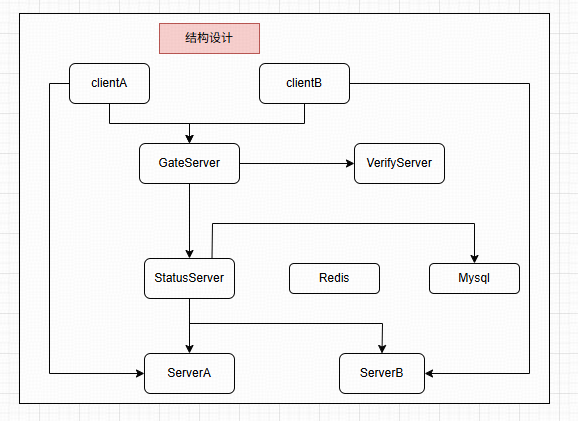

# 架构设计
  
1.GateServer为网关服务，主要应对客户端的连接和注册请求，因为服务器是是分布式，所以GateServer收到用户连接请求后会查询状态服务选择一个负载较小的Server地址给客户端，客户端拿着这个地址直接和Server通信建立长连接  
2.当用户注册时会发送给GateServer, GateServer调用VarifyServer验证注册的合理性并发送验证码给客户端，客户端拿着这个验证码去GateServer注册即可  
3.StatusServer， ServerA， ServerB都可以直接访问Redis和Mysql服务。
